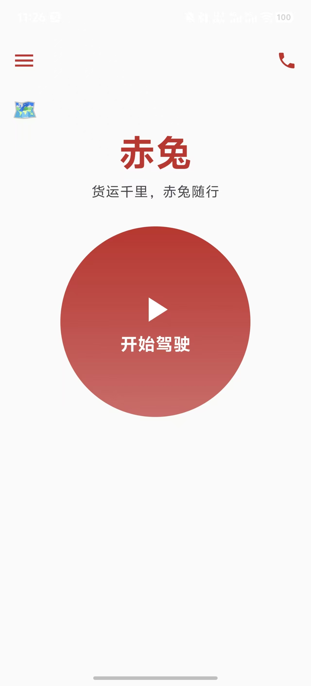
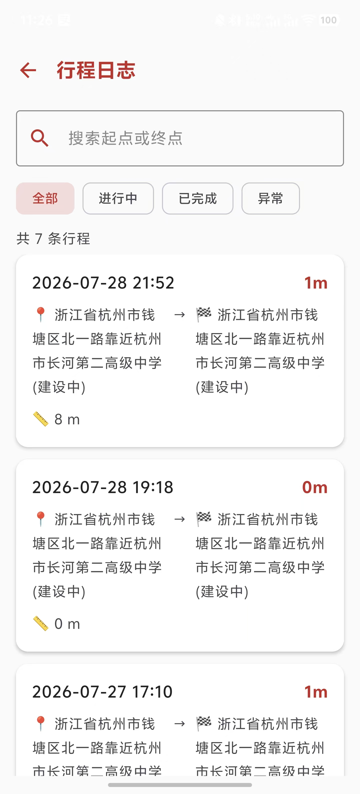
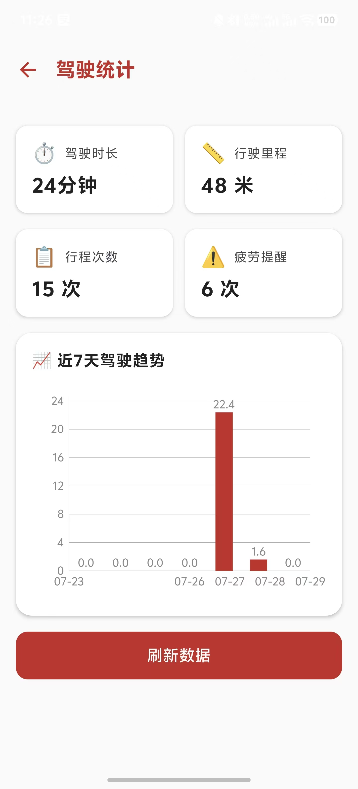
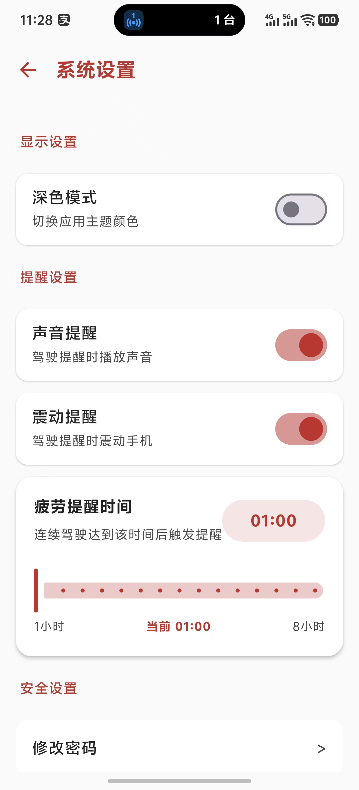
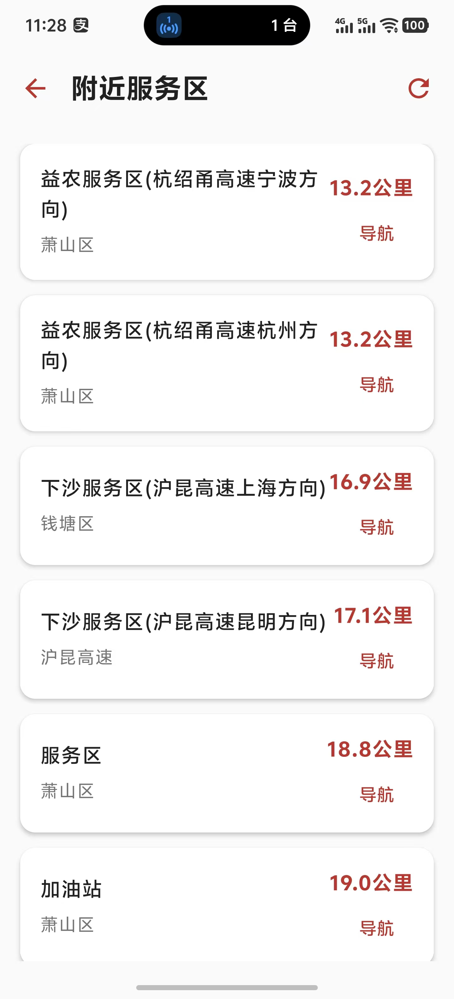
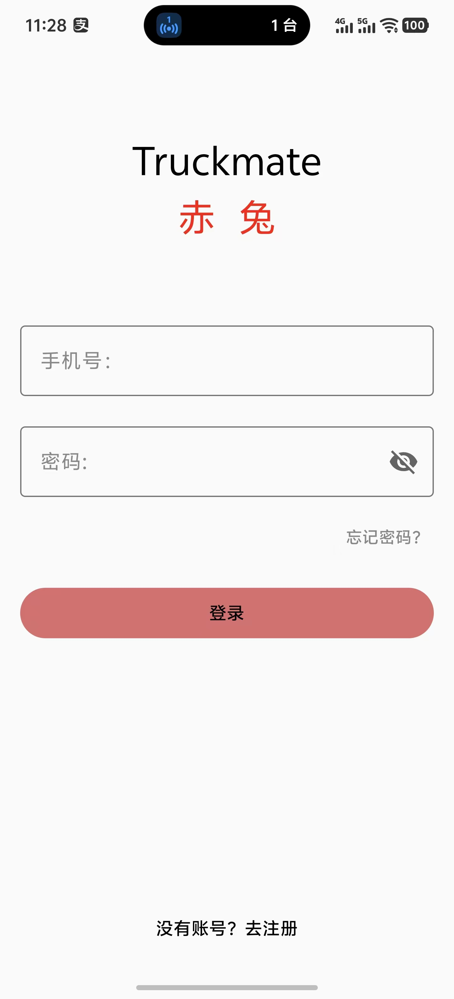

<p align="center">
  
  <h1 align="center">🐎 赤兔 · Chitu</h1>
  <p align="center">
    面向长途货车司机的智能驾驶辅助系统 · Android 客户端
  </p>
  <p align="center">
    <a href="#-architecture"></a>
    <a href="#-tech-stack"></a>
    <a href="#-tech-stack"></a>
    <a href="#-tech-stack"></a>
    <a href="#-tech-stack"></a>
  </p>
</p>

---

## 📋 项目简介

**赤兔（Chitu）** 是一个面向长途货车司机的智能驾驶辅助系统。本项目是 **Android 客户端**，为驾驶员提供驾驶监测、疲劳提醒、行程管理、驾驶统计、服务区查询等核心功能。

系统采用 **Android + Spring Boot + Vue3** 前后端分离架构，后端服务和管理后台分别维护在独立仓库中。

---

## 🏗️ Architecture

```
┌──────────────────────────────────────────────────────────────────┐
│                         PRESENTATION LAYER                       │
│  ┌──────────┬──────────┬──────────┬──────────┬────────────────┐  │
│  │  Splash   │  Login   │   Home   │   Trip   │  Settings      │  │
│  │  Screen   │  Screen  │  Screen  │  List    │  Screen        │  │
│  ├──────────┼──────────┼──────────┼──────────┼────────────────┤  │
│  │  Profile  │  Security│  Service │  Stats   │  Forgot       │  │
│  │  Screen   │  Screen  │  Area    │  Screen  │  Password     │  │
│  └──────────┴──────────┴──────────┴──────────┴────────────────┘  │
│                    Jetpack Compose + Material3                    │
├──────────────────────────────────────────────────────────────────┤
│                         VIEWMODEL LAYER                           │
│              8 ViewModels · StateFlow · Factory DI                │
├──────────────────────────────────────────────────────────────────┤
│                        REPOSITORY LAYER                           │
│  ┌──────────────┬──────────────┬──────────────────────────────┐   │
│  │  Security    │  Location    │  ServiceArea                  │   │
│  │  Repository  │  Repository  │  Repository                   │   │
│  └──────────────┴──────────────┴──────────────────────────────┘   │
├──────────────────────────────────────────────────────────────────┤
│                          DATA LAYER                               │
│  ┌─────────────┬──────────────┬──────────────┬────────────────┐   │
│  │  Room       │  DataStore   │  Retrofit    │  WorkManager   │   │
│  │  TripLog    │  Preferences │  AuthApi     │  TripSync      │   │
│  │  DB v4      │  Token/Settings│ 13 endpoints│  15min周期     │   │
│  └─────────────┴──────────────┴──────────────┴────────────────┘   │
├──────────────────────────────────────────────────────────────────┤
│                       INFRASTRUCTURE LAYER                        │
│  ┌──────────────────────┬─────────────────────────────────────┐   │
│  │  DrivingService      │  TripSyncWorker                     │   │
│  │  Foreground Service  │  CoroutineWorker                    │   │
│  │  高德GPS + 协程计时    │  网络约束 + 指数退避                 │   │
│  └──────────────────────┴─────────────────────────────────────┘   │
└──────────────────────────────────────────────────────────────────┘
```

### 架构决策

| 决策 | 选择 | 依据 |
|:-----|:-----|:------|
| UI 框架 | Jetpack Compose | 声明式 UI，与 StateFlow 天然集成 |
| 状态管理 | StateFlow + collectAsState | 生命周期感知，Compose 原生支持 |
| 本地存储 | Room + DataStore | Room 用于结构化数据；DataStore 用于键值配置 |
| 后台任务 | WorkManager | 兼容所有 API 级别后台限制，支持约束条件 |
| 网络层 | Retrofit + OkHttp | 声明式 API，Gson 自动序列化，日志拦截 |
| DI | ViewModelProvider.Factory | 轻量手动注入，无需 Hilt 等重型框架 |

---

## 🛠 Tech Stack

| Layer | Technology | Version | Purpose |
|:------|:-----------|:--------|:--------|
| Language | **Kotlin** | 2.2.10 | 空安全、协程支持 |
| UI | **Jetpack Compose** + Material3 | BOM 2026.02.01 | 声明式 UI，12 个 Screen |
| Architecture | MVVM + Repository | — | 关注点分离 |
| Database | **Room** | 2.8.4 | 本地持久化，编译期 SQL 校验 |
| Network | **Retrofit** + OkHttp + Gson | 2.9.0 | RESTful API |
| Background | **WorkManager** | 2.9.0 | 兜底数据同步 |
| Config | **DataStore** Preferences | 1.1.0 | 设置缓存、Token 管理 |
| Map | **高德定位 SDK** | 6.4.5 | GPS 位置采集 |
| Charts | MPAndroidChart | v3.1.0 | 驾驶统计图表 |
| Navigation | Navigation Compose | 2.7.7 | 页面路由 |
| Min SDK | Android 10 | API 29 | — |
| Target SDK | Android 16 | API 36 | — |

---

## ✨ 功能模块

### 🚗 驾驶监测（核心模块）

| 能力 | 实现方式 |
|:-----|:---------|
| 驾驶启动/停止 | Foreground Service + 通知栏常驻 |
| GPS 轨迹采集 | 高德定位 SDK 6.4.5，2s 间隔，精度 ≤50m 过滤 |
| 驾驶计时 | 时间戳方案，协程每秒更新 StateFlow |
| 进程恢复 | DataStore 持久化 startTime，杀进程后可恢复 |
| 里程计算 | GPS 坐标间球面距离累加 |

**核心文件：** `DrivingService.kt`（~700 行前台服务）、`DrivingViewModel.kt`

### ⚠️ 疲劳提醒

- 多模态提醒：震动（Vibrator）+ 声音（RingtoneManager）+ 通知栏
- 提醒间隔 30-240 分钟可调（默认 240）
- 提醒事件自动上传后端，关联当前行程（tripId）

### 📋 行程日志

- **本地优先**：数据先写 Room，立即同步，WorkManager 兜底
- **幂等同步**：UUID 作为 clientId，后端查重防止重复
- **三级状态机**：syncStatus = 0（待同步）/ 1（已同步）/ 2（同步失败）
- 支持关键词搜索 + 状态筛选

### 📊 驾驶统计

- 四个核心指标卡片：总里程、总时长、总行程数、疲劳提醒次数
- 近 7 日里程趋势柱状图（MPAndroidChart）
- 数据来源：Room 本地实时聚合（离线可用）

### 🗺️ 服务区查询

- 高德定位 SDK 获取位置 → 高德 Web API 搜索 50km 服务区 → 列表展示 → 点击导航

### 🔐 用户认证与安全

- 注册/登录/自动登录/退出
- JWT（24h）+ BCrypt 密码加密
- 忘记密码（三步：手机号→密保验证→重置）
- 密保设置与安全验证
- Room 层 userId 字段实现用户数据隔离

### ⚙️ 系统设置

- 深色模式全局切换
- 声音/震动独立开关
- 疲劳提醒间隔滑块

---

## 🔧 技术亮点

### 1. 本地优先的离线架构

```
结束驾驶 → Room.insert(syncStatus=0) → 立即同步云端
                                          └─失败→ WorkManager 每15min扫描重试
                                            └─网络未连接→等待约束满足后自动执行
```

所有行程数据优先写入本地 Room 数据库，网络异常时数据不丢失。WorkManager 配置 `NetworkType.CONNECTED` 约束，网络恢复后自动同步。

### 2. UUID 幂等同步机制

```kotlin
// 客户端生成全局唯一 ID
val clientId = UUID.randomUUID().toString()

// 服务端根据 clientId 查重
val existing = tripMapper.selectOne(eq("client_id", clientId))
if (existing != null) return true  // 已存在，直接返回成功
```

解决网络超时导致重复上传的核心问题。无需数据库唯一约束，通过业务代码保证数据一致性。

### 3. Foreground Service + 驾驶状态恢复

```kotlin
// 开始驾驶时持久化时间戳
dataStore.saveStartTimestamp(serviceStartTime)

// App 重启后从 DataStore 恢复驾驶
val savedTime = dataStore.getStartTimestamp()
if (savedTime != null) restoreDrivingState(savedTime)
```

驾驶状态穿越 Activity 和进程生命周期。即使系统杀进程、用户清后台，驾驶计时和 GPS 跟踪依然可恢复。

### 4. 用户数据隔离

| 层级 | 保障措施 |
|:-----|:---------|
| Room | `trip_log.userId` 字段 + `WHERE userId = :userId` 查询 |
| 后端 | JWT 解析 userId，服务端数据过滤 |
| DataStore | 退出登录时清除本地缓存，切换用户不污染 |

---

## 🚀 Quick Start

### Prerequisites

| 工具 | 版本 |
|:-----|:-----|
| Android Studio | Ladybug+ |
| JDK | 17 |
| Gradle | 9.5.1 |
| Android 设备 | API 29+（真机，含 GPS） |

### Setup

```bash
# 1. 克隆
git clone https://github.com/ZonEn123/chitu-android.git

# 2. 配置后端地址
# 编辑 data/remote/RetrofitClient.kt → BASE_URL

# 3. 配置高德地图 Key
# 编辑 AndroidManifest.xml → com.amap.api.v2.apikey

# 4. 构建运行
./gradlew assembleDebug
```

### 依赖服务

- **[chitu-backend](https://github.com/ZonEn123/chitu-backend)** — Spring Boot API 服务
- **[chitu-admin](https://github.com/ZonEn123/chitu-admin)** — Vue3 管理后台

---

## 📸 Screenshots

| 首页驾驶 | 行程列表 | 驾驶统计 |
|:---------|:---------|:---------|
|  |  |  |
| **系统设置** | **服务区查询** | **登录页** |
|  |  |  |
---

## 📁 项目规模

| Metric | Count |
|:-------|:------|
| Kotlin 源文件 | 58 |
| Compose Screen | 12 |
| ViewModel | 8 |
| Repository | 3 |
| API 接口 | 13 |
| Room 版本 | 4（含 3 次 Migration） |
| 前台 Service | 1（DrivingService） |
| WorkManager Worker | 1（TripSyncWorker） |

---

## 📄 License

MIT © 2026 Peng Zheng

本代码仅用于毕业设计展示与学习参考。

---
